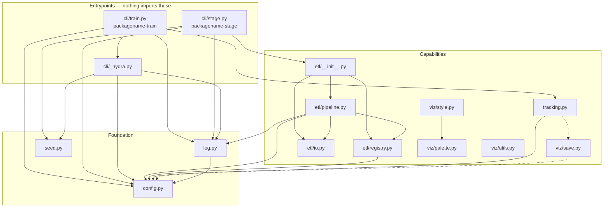
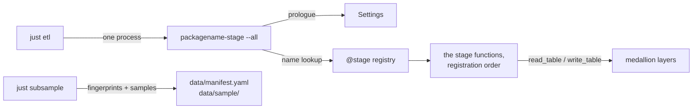

# Architecture

This document is the structural view: what the pieces are, which way they depend
on each other, who decides what, and which invariants hold everywhere. It is
meant for the reader who has to change something and needs to know what else that
touches.

It is not a tutorial and not a reference. The [README](README.md) is the tour and
[`docs/`](docs/README.md) is the per-topic reference; this page links out rather
than repeating them.

## The shape of the system

Three layers, and the dependency arrows only ever point downwards. Dotted arrows
are imports deferred into a function body.

The graph is acyclic, and a few of its properties are load-bearing rather than
accidental:

- **`config.py` imports nothing from the package.** It is the root of the graph,
  which is what lets every other module depend on it without a cycle.
- **`etl/io.py`, `viz/palette.py`, `viz/utils.py` and `seed.py` import nothing
  from the package either.** They are pure utilities and can be read, tested or
  lifted out in isolation.
- **`etl` and `tracking` never import each other.** A transformation does not know
  that experiment tracking exists, and the tracker does not know about the ETL.
- **The two cross-cutting edges are deferred on purpose.** `tracking.log_figure`
  imports `viz.save` inside the method, and `viz.save.savefig` imports
  `get_settings` inside the function. Together with `wandb` and
  `matplotlib.pyplot` being imported lazily in `tracking`, that is what keeps
  `import packagename` from pulling in W&B and Matplotlib.
- **Nothing imports `cli`.** Entrypoints are leaves; all their logic is delegated
  to the layers below, so anything worth testing is reachable without a subprocess.
- **Stages register themselves as a side effect of import.** `cli/stage.py` imports
  the `etl` package, whose `__init__` imports `pipeline`, whose `@stage` decorators
  populate the registry — in import order, which is also the pipeline order. A
  stage in a module nothing imports is a stage `packagename-stage --list` cannot
  see — which is why new stages belong in `pipeline.py`, or in a module that
  `etl/__init__.py` imports.

| Module | Role |
|---|---|
| `config.py` | Typed settings, source precedence, absolute paths. The spine. |
| `log.py` | Root logger configuration from settings; `get_logger` for modules. |
| `seed.py` | Seeds Python, NumPy, and torch/TensorFlow when installed. |
| `tracking.py` | W&B facade, run lifecycle, git provenance. |
| `etl/io.py` | Tabular read/write with format dispatch and atomic writes. |
| `etl/registry.py` | Maps a stage name on the command line to a Python function. |
| `etl/pipeline.py` | The stage implementations themselves. |
| `data/sample.py` | Per-region subsamples of the raw layer, and the dataset manifest. |
| `viz/palette.py` | Project colours. |
| `viz/style.py` | Matplotlib rcParams presets built on the palette. |
| `viz/save.py` | `savefig`, resolving relative paths under `paths.figures`. |
| `viz/utils.py` | Touch-ups for finished axes. |
| `cli/_hydra.py` | The shared entrypoint prologue. |
| `cli/stage.py` | `packagename-stage`: runs one ETL stage. |
| `cli/train.py` | `packagename-train`: a Hydra-driven training job. |
| `data/`, `features/`, `models/` | Empty markers for domain code. See [Current state](#current-state). |

## Configuration is the spine

`configs/config.yaml` has **two** consumers, and every design decision around
configuration falls out of that:

| Consumer | Reads it | Cares about |
|---|---|---|
| `Settings` (pydantic) | via `StrictYamlSource`, ignoring the `defaults` and `hydra` keys | every setting, validated |
| Hydra | as its own config, composed with CLI overrides | the whole file, including `hydra:` |

The versioned file is also the *only* source of ETL parameters. A value injected
through `.env`, a `PACKAGENAME_*` variable or a Hydra override would leave no
trace in `git log`, and the committed samples and manifest describe data produced
by the file's values. That is the reason `packagename-stage` is deliberately not
a Hydra entrypoint, and the reason ETL parameters live in the YAML and nowhere
else.

Precedence, lowest to highest: field defaults → `configs/config.yaml` → `.env` →
`PACKAGENAME_*` environment variables → explicit values. `Settings` implements it
by ordering the sources in `settings_customise_sources`. The Hydra path takes
extra care: Hydra hands over the YAML and the typed overrides already merged, so
`settings_from_mapping` splits them apart — the merged mapping enters at *file*
precedence and only the keys the user actually typed enter as explicit values.
Otherwise the YAML's own defaults would outrank the environment and `.env` would
go quietly dead for the commands people run most. See
[docs/configuration.md](docs/configuration.md).

Four `ContextVar`s carry this without any global mutable state:

| Variable | Purpose |
|---|---|
| `_yaml_file_override` (config) | point the YAML source at a different file |
| `_file_level_mapping` (config) | inject Hydra's composed config at file precedence |
| `_active_settings` (config) | what `get_settings()` returns inside `use_settings` |
| `_active` (tracking) | the innermost open run, for `active_tracker()` |

`PROJECT_ROOT` is derived from `config.py`'s own location, and `Paths` resolves
every relative directory against it at validation time. So paths are absolute
before any code sees them, which is what makes `hydra.job.chdir: false` safe and
`savefig(fig, "loss.png")` land in `reports/figures/` from a notebook, a script or
a Hydra job alike.

## Control flow

Every entrypoint runs the same prologue, in the same order, before any work: build
and validate the settings, bind them, configure logging, seed, create directories.
`cli/_hydra.py` exists so that prologue is written once.

| | `packagename-train` | `packagename-stage` / `packagename-data` | Notebook |
|---|---|---|---|
| Settings from | Hydra composition + CLI overrides | `load_settings()` — the YAML and environment only | `get_settings()` |
| Bound with `use_settings` | yes | yes | no (the cached default is already global) |
| CLI overrides | yes, plus `--multirun` sweeps | **no**, by design | n/a |
| Tracking | opens a run around the work | none | caller's choice |
| Invoked by | a human | a human, usually via `just` | a human |

The registry is intentionally thin: it knows names and functions, and nothing
about inputs, outputs, hashes or freshness. `run_stage` always runs. Nothing in
the project decides to skip a stage — the pipeline is short enough that running
it is cheaper than maintaining a second mechanism that answers "what changed?".

## Who decides what

| Question | Answered by | Not by |
|---|---|---|
| What does a parameter equal? | `configs/config.yaml` | a literal in a function body |
| Is a configuration value valid? | `Settings`, at load time | the caller |
| In which order do stages run? | registration order in `etl/pipeline.py` | a flag, a graph file |
| Is this sample still fresh? | `packagename-data check`, against the manifest | memory |
| Where does this file belong? | `Settings.paths` | the working directory |
| Which stages exist? | the `@stage` registry | — |
| Which values did this run use? | the composed config, bound with `use_settings` and logged to the run | ambient state |
| What produced this artifact? | the run record: commit, branch, dirty flag, resolved config | memory |
| Where do the dataset bytes live? | the machine that runs the real workloads | Git (which carries samples and fingerprints) |

## Data flow

Two pipelines share the medallion layout and neither is aware of the other.

**The ETL pipeline** — the registered stages, currently two:

| Stage | Params | Writes |
|---|---|---|
| `generate_measurements` | `random_seed`, `etl.rows` | `data/raw/measurements.csv` |
| `aggregate_measurements` | `etl.threshold` | `data/silver/measurements.parquet` |

Both are the worked example that ships with the template: the first *synthesises*
its raw input, so a fresh clone runs the whole pipeline with nothing to download.
Real raw data does not come from a stage — it arrives from outside the project,
one directory per region under `data/raw/`, git-ignored. What Git knows about it
is `data/manifest.yaml`: a sha256, size and mtime per file, written by
`packagename-data subsample` together with the committed per-region samples under
`data/sample/`. See [docs/etl.md](docs/etl.md).

**The notebook chain** — `notebooks/01`…`05`, where the numbering *is* the
dependency order; each reads what the previous wrote. `02` decides the
train/validation/test partition once, and the `split` column of
`data/gold/model_matrix.parquet` is what the later notebooks inherit instead of
each recomputing a partition of its own. The chain is tabulated in
[docs/workflow.md](docs/workflow.md).

The stack the notebooks import lives in the `analysis` dependency group rather
than in `dependencies`, because nothing under `src/` imports it yet and `deptry`
would report every entry as unused. `[tool.uv] default-groups` installs it anyway,
so a bare `uv sync` cannot produce a narrower environment than the one CI tests.

## Invariants

The rules that hold across the whole repository. Breaking one is a design change,
not a local one.

1. **No path depends on the working directory.** Everything is anchored to
   `PROJECT_ROOT` and absolute by the time it leaves `Settings`.
2. **No Python code decides freshness.** Stages always do their work; the caller
   decides whether the work is worth doing.
3. **Anything that determines an output lives in the versioned config** —
   parameter keys in `configs/config.yaml`, paths in `Settings.paths` — so a
   change is a commit, visible in `git log`.
4. **Unknown configuration keys are errors**, in the YAML, in a CLI override and in
   `load_settings` arguments alike. Config sections are `extra="forbid"`.
5. **Secrets never enter `Settings`.** `WANDB_API_KEY` lives in `.env` and is read
   by W&B directly, so no settings field can hold a credential.
6. **Writes are atomic.** `write_table` writes to a temporary file in the
   destination directory and renames it into place, so a half-written file never
   looks like a finished one. The guarantee covers an interrupted process, not a
   power cut — nothing calls `fsync`.
7. **One process per stage**, so no stage can depend on state another left in memory.
8. **A stage accepts no command-line overrides**, because the samples and the
   manifest describe data produced by the versioned file's values.
9. **Every tracked run carries provenance**: commit, branch, a `dirty` tag when the
   tree had uncommitted changes, and the fully resolved config.
10. **`import packagename` stays cheap.** Heavy dependencies are imported inside the
    functions that need them.

## Seams

Places designed to be replaced or extended without touching their callers.

| Seam | Where | What it buys |
|---|---|---|
| `ExperimentTracker` | `tracking.py` | one class to reimplement if the tracking backend changes; `tracker.run` is the escape hatch meanwhile |
| Format dispatch | `etl/io.py` | a new tabular format is two branches; anything non-tabular needs its own writer, keeping the temp-and-rename pattern |
| Stage registry | `etl/registry.py` | a new stage is one decorated function |
| Style presets | `viz/style.py` | a new medium is one entry in `PRESETS`; only sizes differ between presets |
| Entrypoint prologue | `cli/_hydra.py` | a new command is one decorated function |

Where domain code goes is tabulated in [docs/README.md](docs/README.md).

## Current state

The infrastructure is complete; the domain code is not. Stated plainly, because
the difference is not visible from the module layout:

- **`data/`, `features/` and `models/` are empty** — a docstring and nothing else.
  They mark the intended home for domain code without guessing at its shape.
- **`cli/train.py::_train` is a placeholder** that logs a warning. Everything around
  it — config, seeding, logging, the open run, artifact paths — is wired.
- **The two ETL stages are the template's example**, not domain transformations.
- **There are no ETL transformation helpers.** `packagename.etl` provides tabular IO
  and the stage registry; there is no normalisation, scaling, imputation or
  filtering utility. The real preprocessing currently lives in
  `notebooks/02_preprocessing.ipynb` as notebook-local functions and a
  scikit-learn `Pipeline`. Promoting it into `packagename.features` is the natural
  next step; `[project] dependencies` is where its imports move when it does.
- **`viz` contains no plotting functions.** It covers style, palette, saving and
  axis touch-ups; the plotting itself is Matplotlib, called directly.
- **The package is still named `packagename`**, as are the console scripts and the
  `PACKAGENAME_*` prefix. See
  [docs/renaming-the-package.md](docs/renaming-the-package.md).
- `docs/CONTEXT_SNAPSHOT.md` and `scripts/generate_context_snapshot.py` are a
  local aid for pasting a condensed view of the tree into a conversation. They are
  generated, not authoritative, and regenerating them is manual.

## How the architecture is enforced

The invariants above would decay without something checking them, so most of them
have a gate:

| Invariant | Enforced by |
|---|---|
| Config keys exist and are typed | pydantic at load time; `tests/test_config.py` |
| The sampler honours its contract | `tests/test_sample.py` — seeded reproducibility, stable sources, drift detection, incremental hashing |
| Entrypoints stay runnable | CI invoking `packagename-stage --list`, `packagename-stage --all` and `packagename-train` |
| Tests touch neither the network nor `$HOME` | `tests/conftest.py`: `WANDB_MODE=disabled`, the `Agg` backend, `PACKAGENAME_*` stripped, W&B and Matplotlib caches redirected to `tmp_path` |
| Annotations present, then consistent | Ruff `ANN` rules, then `ty` (`notebooks/` excluded: the scientific stack is too thinly typed for the diagnostics to mean anything) |
| Dependencies declared and used | `deptry`, with documented exceptions for `xarray` (lazy NetCDF sampling, lives in the analysis group), `pyarrow` (used but never imported) and `torch`/`tensorflow` (optional) |
| Coverage | `--cov-fail-under=85` |

`just check` runs the same set CI does. The full gate schedule — commit, commit
message, push, CI, weekly audit — is in the [README](README.md#quality-gates) and
[docs/workflow.md](docs/workflow.md).
